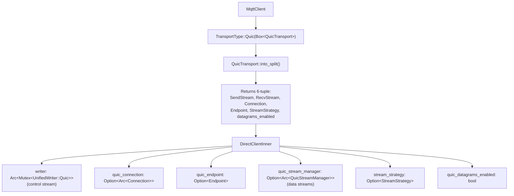
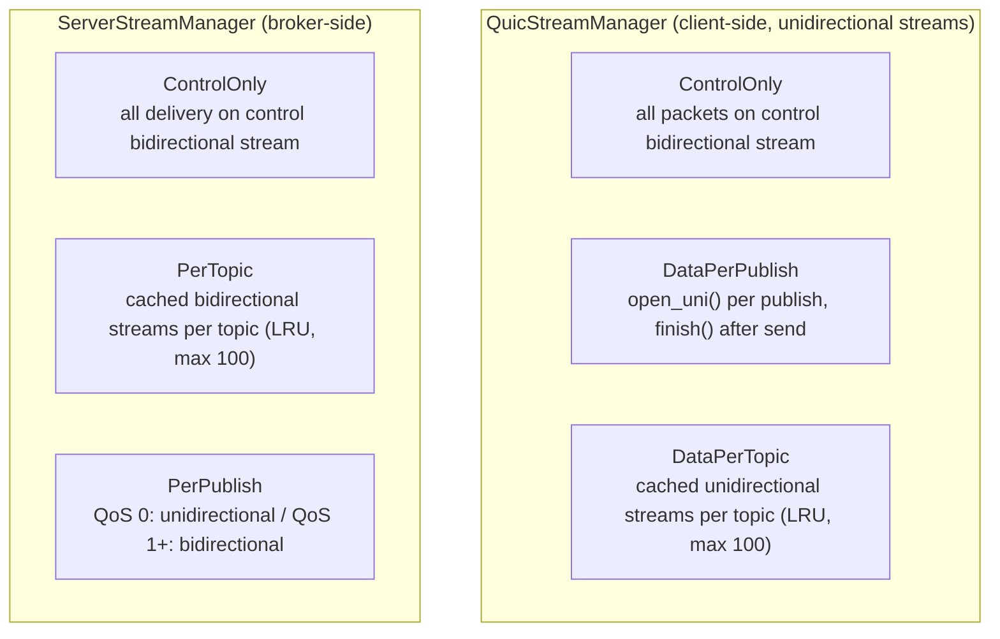

# QUIC Transport Guide

MQTT over QUIC provides modern, high-performance transport with built-in encryption, multistream support, and connection migration.

## Overview

QUIC transport offers several advantages over TCP+TLS for MQTT:

- **Built-in TLS 1.3** — encryption is mandatory in QUIC, eliminating the separate TLS handshake
- **Multistream support** — parallel MQTT operations without head-of-line blocking
- **Connection migration** — seamless network address changes for mobile clients
- **Flow headers** — stream state recovery for persistent QoS sessions
- **Datagram support** — unreliable delivery for QoS 0 (RFC 9221)

Both client and broker support QUIC transport. The client auto-detects QUIC from the URL scheme (`quic://` or `quics://`).

## Stream Strategies

QUIC multistream support allows different stream allocation strategies:

| Strategy | Description | Use Case |
|----------|-------------|----------|
| `ControlOnly` | Single bidirectional stream for all packets | Simple deployments, maximum compatibility |
| `DataPerPublish` | New unidirectional stream per QoS 1/2 publish | High-throughput publishing |
| `DataPerTopic` | Dedicated cached stream per topic (LRU, max 100) | Topic isolation |

> **Note:** `DataPerSubscription` is deprecated and architecturally identical to `DataPerTopic`. Use `DataPerTopic` instead.

**Control stream** carries: CONNECT, CONNACK, SUBSCRIBE, SUBACK, UNSUBSCRIBE, UNSUBACK, PINGREQ, PINGRESP, DISCONNECT, AUTH

**Data streams** carry: PUBLISH packets — client-to-broker uses unidirectional streams; broker-to-client uses bidirectional (PerTopic, PerPublish QoS 1+) or unidirectional (PerPublish QoS 0)

**Datagrams** carry: QoS 0 PUBLISH packets that fit within max datagram size (unreliable delivery)

### Client Usage

```rust
use mqtt5::MqttClient;
use mqtt5::transport::StreamStrategy;

#[tokio::main]
async fn main() -> Result<(), Box<dyn std::error::Error>> {
    let client = MqttClient::new("quic-client");

    client.set_quic_stream_strategy(StreamStrategy::DataPerTopic).await;

    client.connect("quic://broker.example.com:14567").await?;

    // Or with custom TLS certificates loaded from PEM bytes
    let ca_pem = std::fs::read("ca.crt")?;
    client.set_tls_config(None, None, Some(ca_pem)).await;
    client.connect("quics://broker.example.com:14567").await?;

    Ok(())
}
```

### Broker Usage (CLI)

```bash
mqttv5 broker \
  --host 0.0.0.0:1883 \
  --quic-host 0.0.0.0:14567 \
  --tls-cert server.pem \
  --tls-key server-key.pem \
  --quic-delivery-strategy per-topic
```

## Connection Migration

QUIC connection migration allows a client's network address to change (e.g., WiFi to cellular) without re-establishing the MQTT session. All streams, subscriptions, and sessions survive the migration.

### Client-Side

```rust
use mqtt5::MqttClient;

let client = MqttClient::new("mobile-client");
client.connect("quic://broker.example.com:14567").await?;

client.subscribe("sensors/#", |msg| {
    println!("{}: {}", msg.topic, String::from_utf8_lossy(&msg.payload));
}).await?;

// Network changes (WiFi → cellular, etc.)
// Migrate to new local address — sessions, streams, subscriptions all survive
client.migrate().await?;

// Continue publishing/subscribing as normal
client.publish("sensors/temp", b"25.5").await?;
```

`MqttClient::migrate()` calls `Endpoint::rebind()` with a freshly bound UDP socket. Non-QUIC transports return an error from `migrate()`.

### Server-Side Detection

The broker automatically detects address changes by comparing `Connection::remote_address()` after each packet. On mismatch, it updates per-IP connection tracking atomically.

## Flow Headers

Flow headers are written at the beginning of each QUIC data stream to identify flow ownership, persistence flags, and expiry. They follow the mqtt.ai Advanced Multistreams specification.

### Flow Header Types

| Type | Byte | Description |
|------|------|-------------|
| Control Flow | 0x11 | Flow type + flow_id (always 0x00) + flags |
| Client Data Flow | 0x12 | Flow type + flow_id + expire_interval + flags |
| Server Data Flow | 0x13 | Flow type + flow_id + expire_interval + flags |
| User-Defined | 0x14 | Flow type + application_data |

### FlowFlags (8-bit bitfield)

| Bit | Field | Description |
|-----|-------|-------------|
| 0 | `clean` | Discard previous persistent flow states |
| 1 | `abort_if_no_state` | Mandate peer abort if state unavailable |
| 2-3 | `err_tolerance` | 2-bit error tolerance level (0-3) |
| 4 | `persistent_qos` | Preserve QoS delivery states |
| 5 | `persistent_topic_alias` | Maintain topic alias mappings |
| 6 | `persistent_subscriptions` | Retain subscription data (client flows only) |
| 7 | `optional_headers` | Indicates optional headers present |

### FlowId

`FlowId(u64)` with LSB ownership bit:
- LSB = 0: client-initiated flow
- LSB = 1: server-initiated flow

## Configuration

### Client Configuration

```rust
use mqtt5::transport::quic::{QuicConfig, StreamStrategy};

let config = QuicConfig::new(
    "127.0.0.1:14567".parse()?,
    "localhost",
)
.with_verify_server_cert(false)
.with_stream_strategy(StreamStrategy::DataPerTopic)
.with_datagrams(true)
.with_flow_headers(true)
.with_flow_expire_interval(600);
```

Key `QuicConfig` options:

- TLS: `client_cert`, `client_key`, `root_certs`, `use_system_roots`, `verify_server_cert`
- Streams: `stream_strategy`, `max_concurrent_streams`
- Datagrams: `enable_datagrams`, `datagram_send_buffer_size`, `datagram_receive_buffer_size`
- Flow headers: `enable_flow_headers`, `flow_expire_interval` (default 300s), `flow_flags`

### URL-Based Connection

```rust
client.connect("quic://broker.example.com:14567").await?;   // system root certs
client.connect("quics://broker.example.com:14567").await?;   // explicit cert verification
```

### Transport Parameters

| Parameter | Client | Broker |
|-----------|--------|--------|
| Max idle timeout | 120s | 60s |
| Stream receive window | 256 KiB | 256 KiB |
| Connection receive window | 1 MiB | 1 MiB |
| Send window | 1 MiB | 1 MiB |
| Datagram send buffer | 64 KiB (configurable) | 64 KiB |
| Datagram receive buffer | 64 KiB (configurable) | 64 KiB |

## Compatibility

Compatible with MQTT-over-QUIC brokers:
- EMQX 5.0+ (native QUIC support, single stream mode only)
- Other QUIC-enabled MQTT brokers

> **Note:** EMQX only supports Single Stream mode. Our multistream implementation is ahead of EMQX — multi-stream tests timeout because EMQX ignores client-initiated data streams.

### MQTT-over-QUIC Modes

| Mode | Description | Our Status | EMQX Status |
|------|-------------|------------|-------------|
| Single Stream | All packets on one bidirectional stream | Supported | Supported |
| Simple Multistreams | Client-initiated streams per topic/publish | Supported | Not supported |
| Advanced Multistreams | Flow headers, persistence, server-initiated | Complete | Not supported |

## Error Handling

| Condition | Error |
|-----------|-------|
| Connect timeout | `MqttError::Timeout` |
| End-of-stream | `MqttError::ClientClosed` |
| Connection/write errors | `MqttError::ConnectionError(...)` |
| Stream open failures | `MqttError::ConnectionError(...)` |
| Already connected | `MqttError::AlreadyConnected` |
| Flow header parse failure | `MqttError::ProtocolError(...)` |

## References

- [Quinn documentation](https://docs.rs/quinn/0.11.9/quinn/)
- [QUIC RFC 9000](https://www.rfc-editor.org/rfc/rfc9000.html)
- [RFC 9221 - Unreliable Datagrams](https://datatracker.ietf.org/doc/html/rfc9221)
- [EMQX QUIC documentation](https://www.emqx.io/docs/en/v5.0/mqtt-over-quic/introduction.html)
- [mqtt.ai MQTT-next specification](https://mqtt.ai/mqtt-next/)

---

## Implementation Details

This section contains source-level details for developers working on the QUIC transport implementation.

### Implementation Status

| Feature | Status |
|---------|--------|
| Client QUIC transport (QuicTransport, QuicConfig) | Complete |
| Control stream support | Complete |
| URL parsing (quic://) | Complete |
| Certificate verification | Complete |
| Simple Multistreams (ControlOnly, DataPerPublish, DataPerTopic) | Complete |
| Per-topic stream caching (LRU eviction) | Complete |
| Broker QUIC support (QuicAcceptor, multi-stream handling) | Complete |
| Server-initiated streams (ServerStreamManager) | Complete |
| Datagram support (QoS 0 over unreliable QUIC datagrams, RFC 9221) | Complete |
| Flow headers (encode/decode for types 0x11-0x14, FlowRegistry) | Complete |
| Connection migration (server detection, per-IP tracking) | Complete |
| Connection migration (client MqttClient::migrate() with Endpoint::rebind()) | Complete |

### Key Files

**Client:**
- `crates/mqtt5/src/transport/quic.rs` — QuicTransport, QuicConfig, StreamStrategy, ClientTransportConfig
- `crates/mqtt5/src/transport/quic_stream_manager.rs` — QuicStreamManager with LRU cache and flow header support
- `crates/mqtt5/src/client/direct/mod.rs` — DirectClientInner stores quic_connection, quic_endpoint, quic_stream_manager
- `crates/mqtt5/src/client/direct/unified.rs` — UnifiedReader/UnifiedWriter with Quic variants

**Broker:**
- `crates/mqtt5/src/broker/quic_acceptor.rs` — QuicAcceptorConfig, connection/stream acceptance
- `crates/mqtt5/src/broker/server_stream_manager.rs` — ServerStreamManager for broker-to-client QUIC stream delivery
- `crates/mqtt5/src/broker/config/transport.rs` — ServerDeliveryStrategy, broker QuicConfig

**Flow Headers & State:**
- `crates/mqtt5/src/transport/flow.rs` — RFC 9000 varint, FlowId, FlowFlags, flow header types, FlowIdGenerator
- `crates/mqtt5/src/session/quic_flow.rs` — FlowState, FlowLifecycle, FlowType, FlowRegistry

### Architecture

#### Client Transport Architecture



#### Multi-Stream Architecture



#### Broker Connection Handling

The broker spawns three concurrent tasks per QUIC connection:

1. **Client handler** — processes packets from control stream via `ClientHandler::run()`
2. **Datagram reader** — reads unreliable datagrams, decodes packets, forwards to handler via mpsc channel
3. **Data stream acceptor** — accepts unidirectional streams (`accept_uni`), spawns per-stream readers that parse flow headers and forward packets to handler

Data stream readers detect flow headers by inspecting the first byte (0x11-0x13) and register flows in a per-connection `FlowRegistry`.

### Internal Types

#### StreamStrategy (Client)

```rust
pub enum StreamStrategy {
    ControlOnly,
    DataPerPublish,
    DataPerTopic,
    #[deprecated(note = "architecturally identical to DataPerTopic; use DataPerTopic instead")]
    DataPerSubscription,
}
```

#### ServerDeliveryStrategy (Broker)

```rust
pub enum ServerDeliveryStrategy {
    ControlOnly,
    #[default]
    PerTopic,
    PerPublish,
}
```

#### ClientTransportConfig

```rust
pub struct ClientTransportConfig {
    pub insecure_tls: bool,
    pub stream_strategy: StreamStrategy,
    pub flow_headers: bool,
    pub flow_expire: Duration,
    pub max_streams: Option<usize>,
    pub datagrams: bool,
    pub connect_timeout: Duration,
}
```

#### QuicTransport

Implements the `Transport` trait. `into_split()` returns a 6-tuple: `(SendStream, RecvStream, Connection, Endpoint, StreamStrategy, bool)`. The `Endpoint` is returned so `DirectClientInner` can call `endpoint.wait_idle()` on disconnect.

Disconnect sequence:
1. `QuicStreamManager::close_all_streams()` finishes all data streams
2. `connection.close(0, b"disconnect")` sends CONNECTION_CLOSE
3. `tokio::spawn(timeout(2s, endpoint.wait_idle()))` waits for draining to complete

#### QuicStreamManager (Client)

Manages client-side data streams using `Arc<Connection>`:
- **DataPerPublish**: opens unidirectional stream, writes optional flow header + packet, calls `finish()`, then `yield_now()` to allow I/O driver to transmit
- **DataPerTopic**: uses `get_or_create_topic_stream()` with LRU eviction (300s idle timeout, max 100 cached streams)
- **Flow headers**: when enabled, writes `DataFlowHeader` (type 0x12) at beginning of each new data stream

#### QuicAcceptorConfig (Broker)

Broker-side QUIC configuration: `cert_chain`, `private_key`, optional `client_ca_certs` with `require_client_cert` for mutual TLS, `alpn_protocols` (default: `["mqtt"]`).

#### ServerStreamManager (Broker)

Manages broker-to-client QUIC stream delivery:
- **ControlOnly**: returns error (caller writes to control stream directly)
- **PerTopic**: cached bidirectional streams per topic with LRU eviction, writes server data flow header (type 0x13)
- **PerPublish**: QoS 0 uses unidirectional; QoS 1+ uses bidirectional with flow header

#### FlowRegistry

Per-connection flow state management: stores up to 256 `FlowState` entries keyed by `FlowId`, tracking lifecycle, subscriptions, topic aliases, and pending packet IDs.

### Variable-Length Integers

Flow headers use RFC 9000 encoding (2-bit length prefix), distinct from MQTT's variable-length integer format:

| Range | Bytes | Prefix |
|-------|-------|--------|
| 0-63 | 1 | 0b00 |
| 64-16383 | 2 | 0b01 |
| 16384-1073741823 | 4 | 0b10 |
| 1073741824-4611686018427387903 | 8 | 0b11 |

### Stream Lifecycle

- **DataPerPublish (client):** open_uni → write flow header → write packet → finish() → yield_now()
- **DataPerTopic (client/broker):** Cached with 300s idle timeout and LRU eviction at 100 streams. Streams are finished on eviction.
- **Control stream:** Persists for connection lifetime. Only closed on disconnect.

### Disconnect Draining

On client disconnect, `conn.close()` is called followed by a background `timeout(2s, endpoint.wait_idle())`. This adapts to actual RTT: completes fast at low latency, waits longer at high latency.

### Dependencies

The project uses Quinn 0.11.x. Both client and broker set ALPN to `mqtt`.

### Testing

**Against our broker (`quic_integration.rs`):**
- test_quic_basic_connection, test_quic_basic_pubsub
- test_quic_qos0_fire_and_forget, test_quic_qos1_at_least_once, test_quic_qos2_exactly_once
- test_quic_control_only_strategy, test_quic_data_per_publish_strategy, test_quic_data_per_topic_strategy
- test_quic_concurrent_publishes, test_quic_large_message, test_quic_reconnect

**Connection migration (`quic_migration_tests.rs`):**
- test_quic_migration_detected_by_server, test_quic_migration_qos1_survives
- test_quic_multiple_migrations, test_migrate_non_quic_returns_error, test_migrate_not_connected_returns_error
